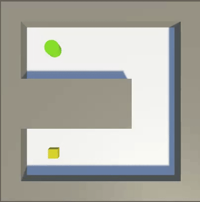
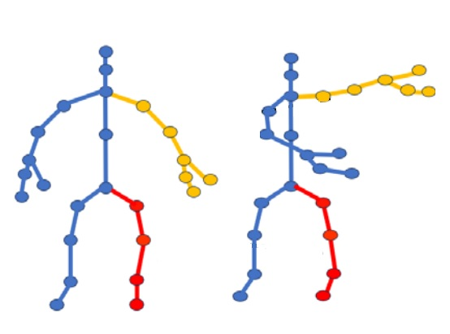
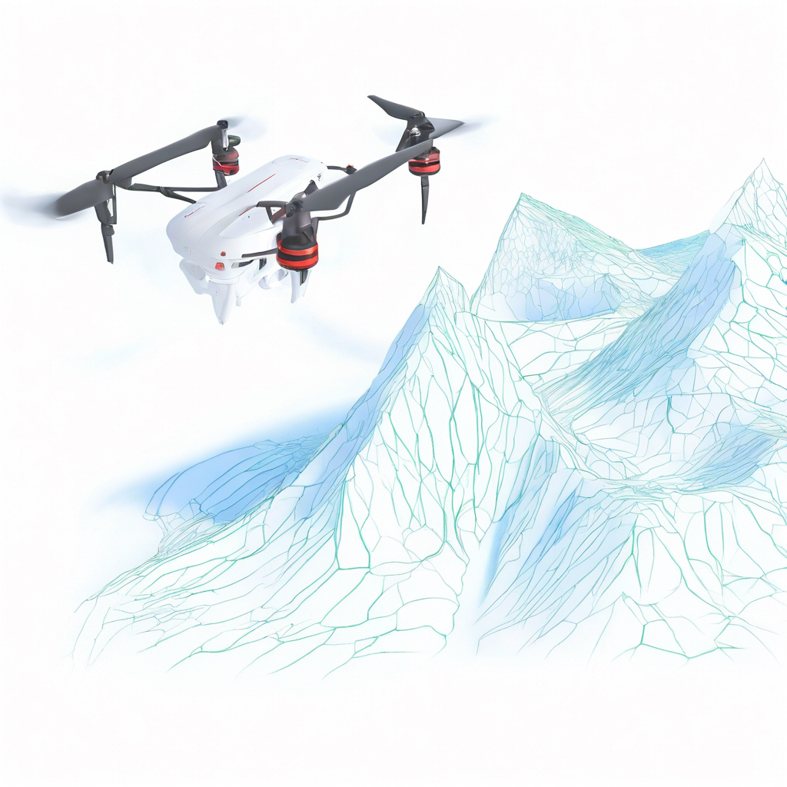
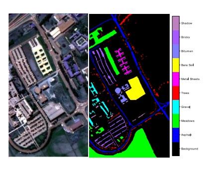

We are working on several research topics in the field of **Machine Learning**, **Computer Vision**, and **Reinforcement Learning**. Here are some of our recent research projects and if you are interested in doing a master in these areas, please contact us.

<table style="border-collapse: collapse; border: none; width: 100%;">  
  <tr>  
    <td colspan="2" style="padding: 20px 0; text-align: left; border: none; vertical-align: top;"><strong>1. Reinforcement Learning for Behavioral Understanding</strong></td>  
  </tr>  
  <tr>  
    <td style="border: none; padding: 10px; text-align: left; vertical-align: top;">  
        
    </td>  
    <td style="border: none; text-align: left; vertical-align: top;">  
      We aim to use RL to analyze complex behaviors. By employing hierarchical RL, we can decompose the learning process into multiple levels, modeling long-term goals at a higher level and specific decisions at a lower level. This approach enhances efficiency and adaptability, facilitating a deeper understanding of the motivations behind behaviors and enabling effective prediction and intervention strategies.  
    </td>  
  </tr>  
  <tr>  
    <td colspan="2" style="padding: 20px 0; text-align: left; border: none; vertical-align: top;"><strong>2. Human activity recognition</strong></td>  
  </tr>  
  <tr>  
    <td style="border: none; text-align: left; vertical-align: top;">  
        
    </td>  
    <td style="border: none; text-align: left; vertical-align: top;">  
      We aim to enhance skeletal action recognition in occluded scenarios. Our objective is to improve accuracy by addressing challenges posed by partial visibility due to obstacles. Utilizing techniques like multi-view learning and temporal context analysis, we seek to infer complete skeletal poses and accurately classify activities, even in complex environments.  
    </td>  
  </tr>  
  <tr>  
    <td colspan="2" style="padding: 20px 0; text-align: left; border: none; vertical-align: top;"><strong>3. Drone Navigation and Geographic Positioning</strong></td>  
  </tr>  
  <tr>  
    <td style="border: none; text-align: left; vertical-align: top;">  
        
    </td>  
    <td style="border: none; text-align: left; vertical-align: top;">  
       Environmental factors like rain, fog, and low visibility can disrupt GPS signals, so we will develop robust algorithms that enhance drone positioning systems. By integrating multimodal sensing, we can leverage both visual and inertial information to improve the accuracy and robustness of drone navigation. 
    </td>  
  </tr>  
    <tr>  
    <td colspan="2" style="padding: 20px 0; text-align: left; border: none; vertical-align: top;"><strong>4. Hyperspectral Image abnormality detection</strong></td>  
  </tr>  
  <tr>  
    <td style="border: none; text-align: left; vertical-align: top;">  
        
    </td>  
    <td style="border: none; text-align: left; vertical-align: top;">  
      Our objective is to leverage the spectral information to detect anomalies indicating unusual substances or conditions, such as environmental changes or material defects. By employing machine learning and spectral analysis, we seek to enhance the accuracy and efficiency of anomaly detection, facilitating applications in agriculture, environmental monitoring, and security.  
    </td>  
  </tr>  
</table>