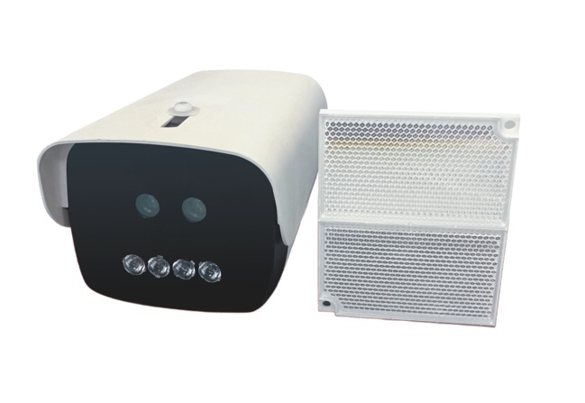

I have worked on several industrial products over the past few years. For more information about these products, please visit their respective [website](http://www.ptstec.cn/product/).

<table style="border-collapse: collapse; border: none; width: 100%;">  
  <tr>  
    <td colspan="2" style="padding: 20px 0; text-align: left; border: none; vertical-align: top;"><strong>1. Image-based Fire Detector</strong></td>  
  </tr>  
  <tr>  
    <td style="border: none; padding: 10px; text-align: left; vertical-align: top;">  
        
    </td>  
    <td style="border: none; text-align: left; vertical-align: top;">  
      <strong>Core:</strong> Quad-core Cortex-A, 1.8 GHz clock speed with Mali GPU.   
      <strong>Algorithm:</strong> Dual DNN model with highly optimized Object Detection algorithm.   
      <strong>Function:</strong> Flame and smoke detection, general object detection.   
    </td>  
  </tr>  
  <tr>  
    <td colspan="2" style="padding: 20px 0; text-align: left; border: none; vertical-align: top;"><strong>2. Explosion-proof Thermal Imaging Flame Detector</strong></td>  
  </tr>  
  <tr>  
    <td style="border: none; text-align: left; vertical-align: top;">  
        
    </td>  
    <td style="border: none; text-align: left; vertical-align: top;">  
      <strong>Core:</strong> Quad-core Cortex-A, 1.8 GHz clock speed with Mali GPU.   
      <strong>Algorithm:</strong> Multi-modal DNN model.   
      <strong>Function:</strong> Thermal imaging, Dual-image fusion.   
    </td>  
  </tr>  
  <tr>  
    <td colspan="2" style="padding: 20px 0; text-align: left; border: none; vertical-align: top;"><strong>3. Light Scattering Smoke Detector</strong></td>  
  </tr>  
  <tr>  
    <td style="border: none; text-align: left; vertical-align: top;">  
        
    </td>  
    <td style="border: none; text-align: left; vertical-align: top;">  
      <strong>Core:</strong> Quad-core Cortex-A.   
      <strong>Algorithm:</strong> Light-field scattering sensoring algorithm.   
      <strong>Function:</strong> Long range smoke detection.   
    </td>  
  </tr>  
  <tr>  
    <td colspan="2" style="padding: 20px 0; text-align: left; border: none; vertical-align: top;"><strong>4. Pedestrian Counter</strong></td>  
  </tr>  
  <tr>  
    <td style="border: none; text-align: left; vertical-align: top;">  
        
    </td>  
    <td style="border: none; text-align: left; vertical-align: top;">  
      <strong>Core:</strong> ARM Cortex-A7, 1.0 GHz.   
      <strong>Algorithm:</strong> Shallow CNN with embedding-optimized image classification algorithm.   
      <strong>Function:</strong> Pedestrian counting, real-time tracking. 
    </td>  
  </tr>  
   <tr>  
    <td colspan="2" style="padding: 20px 0; text-align: left; border: none; vertical-align: top;"><strong>5. Image-based Flame Detector(out-dated)</strong></td>  
  </tr>  
  <tr>  
    <td style="border: none; text-align: left; vertical-align: top;">  
        
    </td>  
    <td style="border: none; text-align: left; vertical-align: top;">  
      <strong>Core:</strong> DSP 600 MHz.    
      <strong>Algorithm:</strong> Traditional image processing algorithm targeting flame properties.   
      <strong>Function:</strong> Flame detection.
    </td>  
  </tr>  
 <tr>  
    <td colspan="2" style="padding: 20px 0; text-align: left; border: none; vertical-align: top;"><strong>6. Fire Cannon</strong></td>  
  </tr>  
  <tr>  
    <td style="border: none; text-align: left; vertical-align: top;">  
        
    </td>  
    <td style="border: none; text-align: left; vertical-align: top;">  
      <strong>Core:</strong> MCU.   
      <strong>Algorithm:</strong> Efficient algorithm for fire targeting.   
      <strong>Function:</strong> Obstacle avoidance, fire extinguishing.
    </td>  
  </tr>  
 <tr>  
    <td colspan="2" style="padding: 20px 0; text-align: left; border: none; vertical-align: top;"><strong>7. Temperature Sensing Cable</strong></td>  
  </tr>  
  <tr>  
    <td style="border: none; text-align: left; vertical-align: top;">  
        
    </td>  
    <td style="border: none; text-align: left; vertical-align: top;">  
      <strong>Core:</strong> MCU.   
      <strong>Algorithm:</strong> Evironmental sensing and Compensation algorithm.   
      <strong>Function:</strong> Recoverable detection.
    </td>  
  </tr>  
</table>